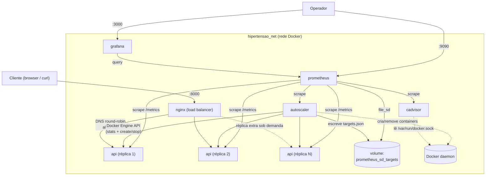

# Arquitetura da API de Hipertensão (v2.0.0)

Este documento descreve a arquitetura de deploy da API que serve o modelo
otimizado por algoritmo genético (Fase 2), incluindo as decisões de
escalabilidade, observabilidade e os trade-offs assumidos.

Esta API vive em `fase2/api/` porque é o entregável de deploy da Fase 2:
ela consome diretamente o vencedor do algoritmo genético
(`modelo_genetico_vencedor.joblib`, produzido por
`fase2/tech_challenge_fase2.py`) e reaproveita a estrutura de código da API
original da Fase 1 (`fase1/`), que permanece intocada como o baseline
histórico (RandomForest com hiperparâmetros manuais).

---

## 1. Contexto e o que mudou nesta versão

| | v1.0.0 (original) | v2.0.0 (esta versão) |
|---|---|---|
| Modelo servido | `fase1/modelo_api/modelo_hipertensao_api.joblib` (Random Forest, hiperparâmetros manuais) | `fase2/api/modelo_api/modelo_genetico_vencedor.joblib` (Random Forest, hiperparâmetros escolhidos por algoritmo genético — `experimento_a`) |
| Variáveis de entrada | 20 variáveis (top-20 por feature importance) | **As mesmas 20 variáveis** — o algoritmo genético otimizou apenas hiperparâmetros do modelo, não o conjunto de features (confirmado em `fase2/tech_challenge_fase2.py`, que carrega `variaveis_entrada` diretamente do `metadata_modelo_api.json` da Fase 1) |
| Deploy | Container único (`docker build` + `docker run`), em `fase1/` | Stack `docker-compose` em `fase2/api/`, com N réplicas atrás de um load balancer, autoscaling, logging estruturado e monitoramento |
| Observabilidade | Nenhuma | Logs JSON + métricas Prometheus + dashboards Grafana |

Os hiperparâmetros vencedores (`resultados/20260810_104008/resumo_final.json`):

```json
{
  "n_estimators": 400,
  "max_depth": 24,
  "min_samples_split": 24,
  "min_samples_leaf": 20,
  "max_features": 0.3,
  "criterion": "entropy",
  "class_weight": "balanced",
  "threshold": 0.5
}
```

`fase1/` permanece exatamente como estava (código original, modelo baseline,
`docker build`/`docker run` simples) — nada lá foi alterado. `fase2/api/`
é uma aplicação irmã e independente: reaproveita o mesmo `api_modelo.py`
como ponto de partida (mesmos endpoints e contrato de entrada), mas aponta
para o modelo genético e já nasce com logging estruturado, métricas e a
stack de deploy descrita abaixo.

**Nota sobre o tamanho do artefato do modelo:** o vencedor bruto do
algoritmo genético (400 árvores) tem ~550 MB — grande demais para o
limite de 100 MB do GitHub, e lento para carregar sob a CPU limitada dos
containers em produção. O modelo servido em `fase2/api/modelo_api/` é uma
versão **podada pós-treino para 50 árvores** (mantidas as primeiras 50
das 400 já ajustadas — estatisticamente intercambiáveis, cada uma vem de
uma amostra bootstrap independente), com impacto desprezível nas métricas
mas ~70 MB e carregamento ~3,5x mais rápido. Comprimir o `.joblib`
(`compress=`) foi testado e descartado: sob o limite de CPU do
`docker-compose.yml` a descompressão é CPU-bound e chegou a levar 70s por
réplica — o oposto do que se quer de um autoscaler. Detalhes e números em
[modelo_api/README.md](./modelo_api/README.md#poda-do-modelo).

---

## 2. Visão geral da arquitetura



**Serviços e portas expostas ao host:**

| Serviço | Porta | Função |
|---|---|---|
| `nginx` | `8000` | Único ponto de entrada público da API (formulário HTML + REST) |
| `grafana` | `3000` | Dashboards (login `admin` / `admin`, também acessível anonimamente como *viewer*) |
| `prometheus` | `9090` | Console de métricas e status dos targets |
| `cadvisor` | `8080` | Métricas de CPU/memória por container |
| `autoscaler` | `9200` | Métricas do próprio autoscaler (`/metrics`) |
| `api` | — (não publicada) | Só acessível dentro da rede Docker, via `nginx` |

---

## 3. Escalabilidade automática com `docker-compose`

O pedido era explicitamente usar `docker-compose` (sem Swarm/Kubernetes).
Isso é uma limitação real a ser transparente: **Compose puro não tem um
controlador de autoscaling nativo** — apenas escala manual (`--scale`) e,
desde a Compose Spec v2, suporte a `deploy.replicas`/`deploy.resources`
mesmo fora do modo Swarm. Para atender "escalabilidade automática para
lidar com variações de demanda" dentro dessa restrição, foram combinadas
três peças:

### 3.1. Baseline fixa (`deploy.replicas`)
O serviço `api` sobe com `deploy.replicas: 2` e limites de recursos
(`cpus: "1.0"`, `memory: 768M` por réplica). Essa é a capacidade mínima
sempre disponível, garantida pelo próprio `docker compose up -d`.

### 3.2. Load balancer com descoberta dinâmica (`nginx`)
Compose atribui a **todas** as réplicas de um serviço o mesmo alias de
rede (`api`), e o DNS embutido do Docker (`127.0.0.11`) faz round-robin
entre os IPs vivos daquele alias. O `nginx.conf` usa a diretiva
`resolver 127.0.0.11 valid=10s` com `proxy_pass` baseado em variável —
truque padrão da comunidade Docker para forçar o nginx a **reconsultar o
DNS a cada 10s** em vez de resolver uma única vez na inicialização. Assim
o balanceamento acompanha novas réplicas (criadas pelo autoscaler ou por
`--scale`) sem reload manual do nginx.

### 3.3. Autoscaler customizado (`autoscaler/autoscaler.py`)
Como o Engine API do Docker não tem o conceito de "réplicas de um serviço
Compose" (isso é só uma convenção de nomes da CLI), o autoscaler implementa
esse controle diretamente:

1. A cada `POLL_INTERVAL_SECONDS` (15s), lista containers com o label
   `hipertensao.role=api` e lê `container.stats()` de cada um (mesma
   fórmula usada pelo `docker stats` para CPU%).
2. Se a **CPU média** ultrapassar `CPU_SCALE_UP_THRESHOLD` (70%) e o total
   de réplicas estiver abaixo de `MAX_REPLICAS` (6), cria um novo
   container clonado da mesma imagem (`hipertensao-api:latest`), conecta-o
   à rede `hipertensao_net` com o **mesmo alias `api`** (assim o nginx já
   enxerga a réplica nova) e marca com o label
   `hipertensao.managed_by=autoscaler`.
3. Se a CPU média cair abaixo de `CPU_SCALE_DOWN_THRESHOLD` (25%) e o total
   estiver acima de `MIN_REPLICAS` (2), remove a réplica **gerenciada**
   mais recente. As réplicas baseline (criadas pelo `deploy.replicas` do
   Compose) nunca carregam esse label e por isso nunca são removidas —
   o piso de capacidade é sempre preservado.
4. Um cooldown (`COOLDOWN_SECONDS`, 60s) evita oscilação (*flapping*) entre
   scale-up e scale-down consecutivos.
5. A cada ciclo, também escreve a lista de réplicas vivas (IP:porta) em
   `prometheus_sd_targets/api-targets.json`, consumido pelo Prometheus via
   `file_sd_configs` — isso resolve o problema de o Prometheus não
   conseguir descobrir sozinho múltiplas réplicas atrás de um único nome
   DNS round-robin.

**Validado em teste de carga real** (45s de requisições concorrentes a
`/prever`): CPU média subiu para ~170%, o autoscaler criou uma 3ª réplica
em ~5s, o nginx já roteou tráfego para ela e o Prometheus a descobriu.
Quando a carga cessou, após o cooldown a réplica extra foi removida
automaticamente, voltando à baseline de 2.

### 3.4. Trade-offs assumidos (importante para avaliação técnica)
- **Não é Kubernetes HPA nem Docker Swarm.** É um controlador de escala
  "artesanal" sobre a Docker Engine API — adequado para demonstrar o
  conceito e para cargas de trabalho pequenas/médias em um único host,
  mas sem as garantias de um orquestrador multi-host (não há
  reprogramação entre nós, nem scheduler de bin-packing).
- **Requer acesso ao socket do Docker** (`/var/run/docker.sock`) montado
  no container `autoscaler`, o que equivale a acesso root ao host. Em
  produção isso deveria rodar em um host dedicado com esse container
  isolado e sem outros privilégios.
- **Métrica de escala é só CPU.** Não considera fila de requisições,
  latência ou memória. Está simples de propósito; os hooks para outras
  métricas já existem via Prometheus (bastaria trocar a fonte da decisão).
- **CPU% pode passar de 100%** por container em hosts multi-core (a base
  de cálculo usa `online_cpus` do host, não a quota de cgroup) — é
  esperado e não indica erro; o que importa é a tendência relativa aos
  thresholds.

Para um ambiente produtivo real, a recomendação é migrar essa mesma
imagem para Kubernetes (HPA baseado em métricas do `metrics-server` ou
KEDA) ou Docker Swarm + um listener de autoscaling — a arquitetura de
imagem/observabilidade construída aqui é compatível com ambos.

---

## 4. Monitoramento e logging

### 4.1. Logging estruturado
`api_modelo.py` usa um `logging.Formatter` customizado que emite **JSON
por linha** no stdout, incluindo `request_id` (correlação por requisição),
`instance_id` (hostname do container — essencial para depurar qual réplica
atendeu qual chamada em um ambiente escalado), método, path, status,
duração e IP do cliente. Erros não tratados também são logados antes de
subir a exceção. Como todos os containers escrevem para stdout, o driver
de log padrão do Docker (`json-file`) já centraliza tudo por container;
para agregação cross-réplica em produção, esses logs JSON já estão prontos
para serem enviados a um coletor (Loki, ELK, CloudWatch etc.) sem
transformação adicional.

### 4.2. Métricas de aplicação (Prometheus)
Expostas em `/metrics` de cada réplica (`prometheus_client`):

- `api_http_requests_total{method,path,status_code}` — contador de requisições
- `api_http_request_duration_seconds{method,path}` — histograma de latência
- `api_predicoes_total{classe_prevista}` — contador de predições por classe
- `api_predicao_probabilidade` — histograma da distribuição de probabilidades
- `api_predicoes_erro_total` — contador de falhas de inferência
- `api_modelo_info{nome_modelo,algoritmo,versao_api,instance_id}` — metadado do modelo carregado

### 4.3. Métricas de infraestrutura
- **cAdvisor** expõe CPU/memória/rede por container (`container_cpu_usage_seconds_total`, etc.), usado tanto pelo dashboard quanto como fonte alternativa de auditoria da decisão do autoscaler.
- **Autoscaler** expõe `autoscaler_current_replicas`, `autoscaler_avg_cpu_percent`, `autoscaler_min_replicas`, `autoscaler_max_replicas` e `autoscaler_last_scale_action_timestamp`.

### 4.4. Dashboards
Grafana provisiona automaticamente (via `monitoring/grafana/provisioning/`)
um datasource Prometheus e o dashboard **"API Hipertensão - Visão Geral"**,
organizado em 4 seções:

- **Saúde da Aplicação** — réplicas UP agora, status por instância
  (UP/DOWN via `up{job="api"}`), taxa de erro HTTP 5xx e erros de
  predição nos últimos 5 minutos.
- **Requisições** — requisições/s por status, latência global (p50/p95/p99),
  requisições por rota e taxa de erro (%) ao longo do tempo.
- **Predições do Modelo** — predições por classe e probabilidade mediana
  prevista.
- **Infraestrutura & Escalabilidade** — réplicas ativas vs. mín/máx, CPU
  média (autoscaler), CPU/memória/rede por container (cAdvisor).

Acesso em `http://localhost:3000` (anônimo como viewer, ou `admin`/`admin`).
Todas as consultas de infraestrutura filtram por
`container_label_hipertensao_role="api"`, o label aplicado a toda réplica
(baseline ou criada pelo autoscaler) — assim os painéis acompanham a escala
automaticamente, sem depender de nomes de container fixos.

> **Nota (Docker Desktop):** o mount do cAdvisor precisa apontar
> diretamente para o arquivo do socket (`/var/run/docker.sock:/var/run/docker.sock`),
> não para o diretório `/var/run` inteiro — só o bind-mount direto do
> arquivo recebe o encaminhamento especial do Docker Desktop para o
> daemon real. Montar o diretório faz o cAdvisor enxergar apenas cgroups
> brutos, sem nomes/labels dos containers, quebrando os painéis por
> container. Com o mount correto (usado neste `docker-compose.yml`),
> CPU/memória/rede por container funcionam normalmente também no macOS.

---

## 5. Como rodar

```bash
cd fase2/api
docker compose up -d --build
```

- Formulário web: `http://localhost:8000`
- Predição: `POST http://localhost:8000/prever`
- Saúde: `GET http://localhost:8000/health`
- Métricas Prometheus (por réplica, via LB): `http://localhost:8000/metrics`
- Prometheus: `http://localhost:9090`
- Grafana: `http://localhost:3000`
- Métricas do autoscaler: `http://localhost:9200/metrics`

Escala manual (além da automática):
```bash
docker compose up -d --scale api=4
```
(o autoscaler nunca reduz abaixo do número de réplicas iniciado dessa forma na baseline do Compose).

Ajustar limites de escala automática (editar em `docker-compose.yml`, serviço `autoscaler`):
`MIN_REPLICAS`, `MAX_REPLICAS`, `CPU_SCALE_UP_THRESHOLD`, `CPU_SCALE_DOWN_THRESHOLD`, `COOLDOWN_SECONDS`.

Parar tudo:
```bash
docker compose down
```

---

## 6. Estrutura de arquivos

```
fase2/
├── api/                         # este stack (v2.0.0) — independente de fase1/
│   ├── docker-compose.yml
│   ├── Dockerfile               # HEALTHCHECK + --app-dir src/app
│   ├── .dockerignore
│   ├── requirements.txt
│   ├── ARCHITECTURE.md          # este arquivo
│   ├── README.md
│   ├── nginx/
│   │   └── nginx.conf           # load balancer com resolver DNS dinâmico
│   ├── autoscaler/
│   │   ├── autoscaler.py        # loop de decisão de escala + Prometheus SD
│   │   ├── requirements.txt
│   │   └── Dockerfile
│   ├── monitoring/
│   │   ├── prometheus.yml
│   │   └── grafana/provisioning/
│   │       ├── datasources/datasource.yml
│   │       └── dashboards/{dashboard.yml, api-overview.json}
│   ├── modelo_api/
│   │   ├── modelo_genetico_vencedor.joblib   # modelo em produção
│   │   ├── metadata_modelo_api.json          # hiperparâmetros/métricas do vencedor genético
│   │   └── exemplo_entrada_api.json
│   └── src/app/
│       ├── api_modelo.py        # logging estruturado + métricas Prometheus
│       └── formulario.html
│
├── src/ ...                     # pipeline de otimização genética (inalterado)
├── tech_challenge_fase2.py      # produz modelo_genetico_vencedor.joblib
└── ...

fase1/                           # inalterado — baseline original da Fase 1
```
